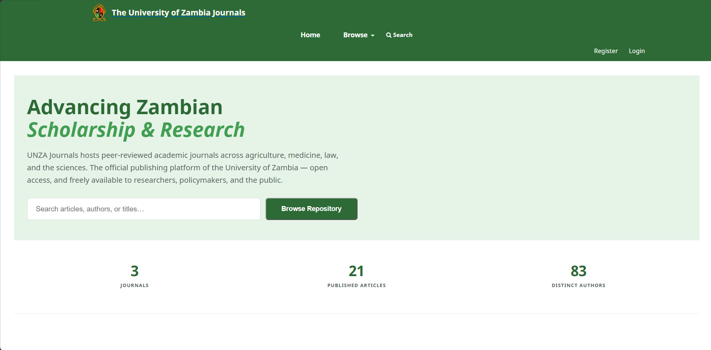
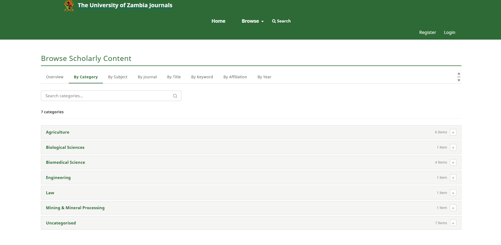
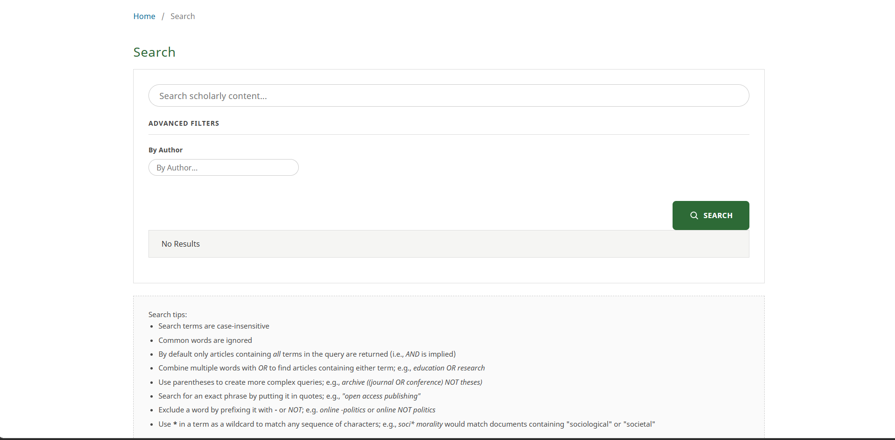

# UNZA Journals — OJS Plugin Package

Two plugins that bring the University of Zambia Journals redesign to any OJS 3.3.x install as proper, upgrade-safe plugins — no core file edits required.

- **`plugins/themes/unza/`** — **UNZA Journals Theme** (class `UnzaThemePlugin`). A child of the OJS default theme. Supplies the green UNZA branding, palette, and the custom header, homepage, site-wide search, and Browse page templates/styling.
- **`plugins/generic/unza/`** — **UNZA Journals Support** (class `UnzaGenericPlugin`). Supplies the backend logic the theme needs that isn't pure template/CSS: the entire "Browse Scholarly Content" page/route (`index.php/browse/<mode>`), and the homepage's platform statistics + recently-published list (both short-TTL cached, ~15 minutes, so they're not recomputed on every request).

---

## Table of contents

- [Requirements](#requirements)
- [Installation](#installation)
- [Enabling the plugins](#enabling-the-plugins)
- [Setting up the "Browse" navigation menu](#setting-up-the-browse-navigation-menu)
- [Verifying the install](#verifying-the-install)
- [Troubleshooting](#troubleshooting)
  - [Theme doesn't appear in the Appearance dropdown](#theme-doesnt-appear-in-the-appearance-dropdown)
  - [Admin/Plugins pages return a 500 error or hang](#adminplugins-pages-return-a-500-error-or-hang)
  - [`##browse.none##` shows literally instead of translated text](#browsenone-shows-literally-instead-of-translated-text)
  - [Browse pages 404, or appear completely unstyled](#browse-pages-404-or-appear-completely-unstyled)
  - [Manually repairing `plugin_settings` via SQL](#manually-repairing-plugin_settings-via-sql)
- [Architecture notes](#architecture-notes)
- [Known limitations / still outstanding](#known-limitations--still-outstanding)
- [Screenshots](#screenshots)
- [Demo video](#demo-video)
- [Repo layout](#repo-layout)

---

## Requirements

- OJS **3.3.x** (built and tested against 3.3.0.14; should work on other 3.3.x releases, untested on 3.4+)
- PHP with the OJS install's normal requirements — nothing extra needed for these plugins
- Write access to `<ojs_root>/plugins/` and the ability to clear `<ojs_root>/cache/`
- Site administrator access to the OJS install (Administration → Site Settings)

## Installation

1. Clone this repo (or download it) and copy the two plugin folders into your OJS install at the **matching path**:
   ```bash
   cp -r plugins/themes/unza   <ojs_root>/plugins/themes/unza
   cp -r plugins/generic/unza  <ojs_root>/plugins/generic/unza
   ```
2. Make sure the web server user owns the new files (adjust `www-data` if your server runs as a different user):
   ```bash
   sudo chown -R www-data:www-data <ojs_root>/plugins/themes/unza <ojs_root>/plugins/generic/unza
   ```
3. Clear the template/file cache and restart the web server:
   ```bash
   sudo rm -rf <ojs_root>/cache/t_compile/* <ojs_root>/cache/fc-*
   sudo service apache2 restart
   ```

## Enabling the plugins

**Always enable both plugins from Administration → Site Settings — not from inside a single journal's own Plugins tab.**

- **Theme:** Administration → Site Settings → **Appearance** → **Theme** → select "UNZA Journals Theme" → Save.
- **Generic plugin:** Administration → Site Settings → **Plugins** → find "UNZA Journals Support" under Generic Plugins → enable it.

Why this matters: enabling a plugin from inside a specific journal's own Plugins page only activates it for that journal (`context_id` = that journal's numeric ID in the `plugin_settings` table), not site-wide (`context_id = 0`). A theme that's only enabled at journal scope will never show up as an option for the site as a whole, and will look enabled-but-broken. See [Troubleshooting](#theme-doesnt-appear-in-the-appearance-dropdown) if this happens.

## Setting up the "Browse" navigation menu

The Browse page and its 8 modes are fully built and routed by `plugins/generic/unza/pages/BrowseHandler.inc.php` once the generic plugin is enabled — but the **"Browse" link in the header is not hardcoded into the theme**. OJS's header pulls the top nav from the database-driven Navigation Menus feature (`{load_menu name="primary"}`), so a "Browse" item has to be created once, manually, per install. The theme's CSS already anticipates this — once the menu item exists it renders correctly with no further changes.

1. Go to **Administration → Site Settings → Setup → Navigation Menus** (labeled "Website Settings → Navigation Menus" on some OJS 3.3.x builds).
2. Under **Navigation Menu Items**, create a new item:
   - **Title:** `Browse`
   - **Type:** Custom URL
   - **URL:** `browse/index`
3. Create one Navigation Menu Item per Browse mode, each as a Custom URL, using these exact paths (pulled directly from `BrowseHandler.inc.php`'s method names — note `browse/journals` is **plural**, a common typo trap):

   | Label | URL |
   |---|---|
   | Overview | `browse/index` |
   | Category | `browse/category` |
   | Subject | `browse/subject` |
   | Journals | `browse/journals` |
   | Title | `browse/title` |
   | Keyword | `browse/keyword` |
   | Affiliation | `browse/affiliation` |
   | Year | `browse/year` |

4. Nest the 8 mode items underneath the top-level "Browse" item, in the order you want them to appear in the dropdown.
5. Open the **Primary Navigation Menu** (the one `{load_menu name="primary"}` references) under the Navigation Menus tab, add the "Browse" item (with its nested children) into it, and Save.
6. Reload the homepage — "Browse" should appear in the header with a working hover/click dropdown listing all 8 modes.

If the dropdown appears but every link 404s, the generic plugin isn't enabled (it registers the `browse` route via a `LoadHandler` hook — without it, none of the URLs above resolve, menu item or not).

## Verifying the install

- Homepage: hero band, stats band, "Our Journals," "Recently Published" all render with UNZA green branding.
- `<your-site>/index.php/index/browse/index` loads the Browse Overview page. **Note the `/index/` context segment is required** — `index.php/browse/index` (without it) will 404 or return a misleading empty response when testing with `curl`, which looks like a routing bug but isn't one.
- Each of the 8 Browse modes loads with working search/filter, pagination, and (where applicable) A–Z filtering.
- Site-wide search (`<your-site>/index.php/index/search/search`) shows the redesigned layout; searching from inside a specific journal still shows the original, unmodified per-journal search UI.

## Troubleshooting

This section captures every real issue hit while getting this package installed, so it isn't repeated.

### Theme doesn't appear in the Appearance dropdown

**Root cause:** `PluginRegistry::loadCategory('themes', true)` (used by `PKPSiteHandler::editTheme()`) ultimately depends on `VersionDAO::getCurrentProducts()`, which joins `versions` to `plugin_settings` like this:

```sql
LEFT JOIN plugin_settings ps
  ON lower(v.product_class_name) = ps.plugin_name
  AND ps.setting_name = 'enabled'
WHERE v.current = 1 AND (ps.setting_value = '1' OR v.lazy_load <> 1)
```

It joins on the **lowercased PHP class name** (`unzathemeplugin`, `unzagenericplugin`) — **not** the plugin's folder/product name (`unza`). Since both plugins use `lazy-load = 1`, this join must succeed for them to appear at all. If a `plugin_settings` row was ever inserted by hand using `'unza'` as `plugin_name`, the theme will look installed correctly (files present, `versions` table correct, no errors logged anywhere) but will simply never show up in the Appearance dropdown or Plugins list.

**Fix:** enable through the UI as described above (this is handled correctly automatically). If you must repair it via SQL, see [Manually repairing `plugin_settings` via SQL](#manually-repairing-plugin_settings-via-sql) below — use the lowercased class name, not the folder name.

### Admin/Plugins pages return a 500 error or hang

**Root cause:** every Site Settings/Admin page load triggers `AdminHandler::initialize()` → `VersionCheck::checkIfNewVersionExists()`, which makes an outbound HTTP request to `pkp.sfu.ca` to check for OJS updates. On a machine without outbound internet access (e.g. certain WSL/sandboxed/offline dev setups), that request hangs for roughly two minutes before throwing an uncaught `GuzzleHttp\Exception\ConnectException`, which surfaces as an HTTP 500 on the Plugins tab and can make every admin page feel broken or extremely slow.

Setting `check_for_updates = Off` under `[general]` in `config.inc.php` does **not** fix this in OJS 3.3.0.14 — `VersionCheck.inc.php` doesn't reference that config key at all in this version, so it has no effect.

**Fix:** make the DNS lookup fail instantly instead of timing out, so the request errors immediately instead of hanging:
```bash
echo "127.0.0.1 pkp.sfu.ca" | sudo tee -a /etc/hosts
```
If your OJS server has normal internet access, you likely won't hit this at all — it's specific to offline/sandboxed dev environments.

### `##browse.none##` shows literally instead of translated text

**Root cause:** an empty Browse result (e.g. a Browse mode with 0 entries) renders the locale key `browse.none`, which wasn't defined anywhere the theme's locale file could pick it up.

**Fix:** already included in this package — `plugins/themes/unza/locale/en_US/locale.po` defines:
```
msgid "browse.none"
msgstr "No results found."
```
If you're merging this into a fork or a different locale, make sure the equivalent key exists in that locale's `.po` file too.

### Browse pages 404, or appear completely unstyled

- **404 on every Browse URL:** the generic plugin isn't enabled, or wasn't enabled at site scope (`context_id = 0`) — see above. It registers the entire `browse` route via a `LoadHandler` hook; without it there is no core fallback for these URLs.
- **Page loads but has zero styling:** almost always a wrong test URL, not a real bug. Test with the full `index.php/index/browse/<mode>` path (see [Verifying the install](#verifying-the-install)) — a bare `index.php/browse/<mode>` can return a response that looks unstyled/empty in tools like `curl` even though the real browser URL works fine.
- If neither applies, clear cache and confirm the theme is actually the *active* theme (Appearance dropdown), not just enabled — an enabled-but-inactive theme plugin won't apply its styles anywhere.

### Manually repairing `plugin_settings` via SQL

Only needed if you're diagnosing a broken install directly — the UI handles this correctly on its own.

```sql
-- Remove any rows that were mistakenly keyed by folder/product name
DELETE FROM plugin_settings WHERE plugin_name = 'unza';

-- Insert correctly, keyed by the LOWERCASED PHP CLASS NAME, at context_id = 0 (site-wide)
INSERT INTO plugin_settings (plugin_name, context_id, setting_name, setting_value, setting_type)
VALUES
  ('unzathemeplugin',   0, 'enabled', '1', 'bool'),
  ('unzagenericplugin', 0, 'enabled', '1', 'bool')
ON DUPLICATE KEY UPDATE setting_value = '1';
```

After any manual DB change:
```bash
sudo rm -rf <ojs_root>/cache/t_compile/* <ojs_root>/cache/fc-*
sudo service apache2 restart
```

## Architecture notes

- The theme plugin (`UnzaThemePlugin`) is a child of the stock `default` theme via `setParent('default')` — it inherits all of the default theme's LESS/layout machinery and only supplies its own palette CSS (registered via `addStyle()`, not a hardcoded `<link>` tag) plus template overrides. OJS resolves template overrides automatically by matching relative path inside the plugin's own `templates/` directory (`Plugin::_overridePluginTemplates()`) — no extra registration code is required for that part.
- `header.tpl` is overridden here specifically because the *original* customization lived inside OJS's `lib/pkp` git submodule, which would be silently wiped by any future `pkp-lib` update. Moving it into the plugin makes it upgrade-safe.
- The generic plugin (`UnzaGenericPlugin`) handles the two things that aren't pure template/CSS:
  1. **Browse routing** — registered via the `LoadHandler` hook, since Browse has no equivalent core page to decorate; it's an entirely new route.
  2. **Homepage stats injection** — via the `TemplateManager::display` hook, firing right before `frontend/pages/indexSite.tpl` renders, so stock `IndexHandler.inc.php` never needs to be touched.
- Both the platform stats (journal/article/author counts) and the recent-submissions list are cached for ~15 minutes using OJS's built-in `CacheManager`/`FileCache`, rather than recomputed on every homepage/Browse request.
- Site-wide search vs. per-journal search share one template (`search.tpl`), but are split with an `{if !$currentJournal}` branch — the journal-context branch is a byte-for-byte copy of the original OJS markup, so per-journal search is guaranteed unaffected by the redesign.

## Known limitations / still outstanding

- The "Browse" navigation menu item is a one-time **manual** setup step per install (see above) — it's not auto-created by either plugin.
- Only Category and Journals Browse modes have been individually re-verified against the `browse.none` locale fix so far. Subject, Title, Keyword, Affiliation, and Year should behave identically (same shared template/logic path) but haven't each been re-checked one-by-one, particularly against low-content installs (few journals, few/no published articles) where every mode may currently show the empty state.
- The homepage's "Browse Repository" button target hasn't been re-confirmed — verify it points at `browse/index` and not the default OJS search page.
- `UnzaThemePlugin::init()` doesn't currently define any `addOption()` calls (unlike `DefaultThemePlugin`, which offers things like a color-scheme picker). This isn't required for the plugin to function, but if you add theme options later, make sure `validateOptions()` has something to validate against — an empty options set combined with certain admin API calls has been known in this OJS version to throw `Call to a member function validateOptions() on null` if an options-related endpoint is hit while none are registered.

## Screenshots

### Homepage


### Browse — Category tab with search + pagination


### Site-wide search


## Demo video

A short walkthrough of the homepage, Browse page, and site-wide search in action.

[Watch the demo](https://drive.google.com/file/d/1Di1pEV1kRCq4vFcrhIoPs0nEWxjROMVq/view?usp=sharing)

## Repo layout

```
unza-plugins/
├── README.md
├── docs/
│   └── screenshots/          (optional — see Screenshots section)
└── plugins/
    ├── themes/unza/
    │   ├── UnzaThemePlugin.inc.php
    │   ├── index.php
    │   ├── settings.xml
    │   ├── version.xml
    │   ├── styles/unza-theme.css
    │   ├── locale/en_US/locale.po
    │   └── templates/frontend/
    │       ├── components/header.tpl
    │       └── pages/{indexSite,browse,search}.tpl
    └── generic/unza/
        ├── UnzaGenericPlugin.inc.php
        ├── index.php
        ├── version.xml
        ├── locale/en_US/locale.po
        └── pages/BrowseHandler.inc.php
```

Anyone cloning this repo and following this README top-to-bottom should reproduce a working install without hitting the `plugin_settings` lowercase-class-name gotcha, the missing `browse.none` locale key, or having to guess at Browse navigation menu URLs — all three cost real debugging time the first time around and are fully documented above.
